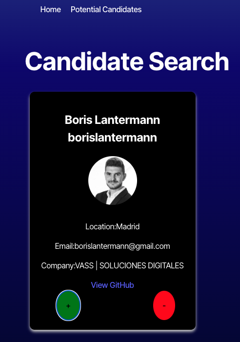
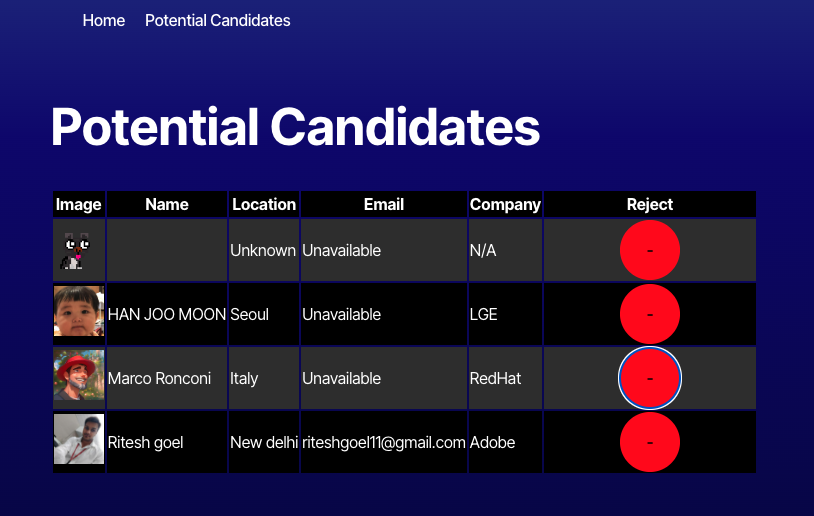

# Candidate-Search

## Description

This project is a Candidate Search Application designed to assist users in identifying and saving the best candidates for potential hiring. The application interacts with the GitHub API to display detailed candidate information, making the hiring process efficient and user-friendly. Application is fully responsive and deployed on Netlify.

## Table of Contents

- [Screenshots](#screenshots)
- [Installation](#installation)
- [Usage](#usage)
- [Credits](#credits)
- [License](#license)

## Installation

To get your environment up and running, follow these steps:

1. Clone this repository to your local machine.
2. Navigate to the project folder and run npm install to install the required dependencies:
npm install
3. Start the development server: npm run dev
4. Application will run on netlify

## Screenshots

 
 

## Usage

Navigate to the Home page where you can perform a candidate search to review profiles fetched from the GitHub API. Use the "+" button to save a candidate or the "-" button to skip. Saved candidates can be viewed on the Potential Candidates page, where their details are stored persistently in local storage, even after page reloads.

## Credits

## License

Licensed under the [MIT](https://opensource.org/licenses/MIT) license.